# DIU22
Prácticas Diseño Interfaces de Usuario 2021-22 (Tema: Hostels) 

Grupo: DIU1_ForTheWin.  Curso: 2021/22 
Updated: 11/2/2022

Proyecto: 

>>> LemonRoom

Descripción: 

>>> LemonRoom será una funcionalidad que permitirá al usuario reservar habitación en el hostel a través de la web.

Logotipo: 
>>> Opcionalmente si diseña un logotipo para su producto en la práctica 3 pongalo aqui

Miembros
 * Ricardo Molina Rodriguez   
 * Carlos Corts Valdivia

----- 

# Proceso de Diseño 

## Paso 1. UX Desk Research & Analisis 

 1.a Competitive Analysis
-----

Las características que hemos decidido evaluar son:
 * Proporciona acceso, o al menos se muestran las redes sociales del hostel.
 * Te permite cambiar el idioma de la web.
 * Facilita más de una forma de contacto.
 * Muestra fotos de las habitaciones.
 * Muestra de forma gráfica (fotos o vídeos) los servicios ofrecidos.
 * Describe el lugar en el que se encuentra, el ambiente que se respira.
 * Ofrece información acerca de medidas tomadas con respecto al Covid.
 Según este análisis, el "White Nest Hostel" sería el mejor competidor, pues cumple con todas las características valoradas. Incluso "Oh! My Hostel" cumple con más características.

 Desde nuestro punto de vista, lo más grave respecto a la web del Lemon Rock es el hecho de no dar la opción de cambiar de idioma. Sin embargo, en el resto de aspectos diríamos que la web del Lemon es mejor, o al menos visualmente más atractiva, mostrando de diversas formas los servicios ofrecidos por el hostel.

 Por un lado, la web de "White Nest Hostel" se ve bastante desfasada, y además el rendimiento es lento con respecto a las otras dos webs valoradas. Por otro lado, se podría decir que la web de "Oh! My Hostel" y del Lemon están a un nivel parecido, aunque como se ha dicho antes, la del Lemon muestra de forma más clara y atractiva lo que vas a encontrar en el hostel.

 1.b Persona
-----

Hemos elegido esta persona debido a que es una persona joven, dado que los jóvenes suelen frecuentar más este tipo de alojamiento. Sin embargo, también hemos querido ver un caso opuesto de una persona mayor para ver el contraste que podemos tener para elegir un hostel. Ambos lo hacen porque es una opción barata, pero para decidir entre uno u otro tienen criterios bastante diferentes.

 1.c User Journey Map
----

Son dos experiencias de usuario ligadas a nuestras dos personas. Se ha realizado de esta forma para ver las situaciones que se pueden encontrar en el proceso de búsqueda y elección, y para demostrar que hay determinados casos en los que una persona mayor tiene más facilidad para encontrar lo que busca ya que le han enseñado y lo hace habitualmente, mientras que para la persona joven es su primera vez. Al final sus criterios la mayoría de las veces son diametralmente opuestos y las sensaciones que produzca la pagina web pueden llegar a ser influyentes a la hora de la elección.

 1.d Usability Review
----

La valoración numérica obtenida a partir de la revisión de usabilidad es de 74 sobre 100. A priori y con los conocimientos que tenemos de momento, consideramos que es una puntuación bastante fiel. La nota es alta, reflejando que se trata de una web relativamente bien diseñada. Sin embargo, no es lo suficientemente elevada, de forma que se podría sacar como conclusión que hay otras tantas webs que quedarían por encima.

## Paso 2. UX Design  

 2.a Feedback Capture Grid / Empathy map / POV
----

Hemos decidido utilizar la malla receptora ya que nos parece la más sencilla y directa de implementar, y además, a partir de la cual podemos sacar más conclusiones.

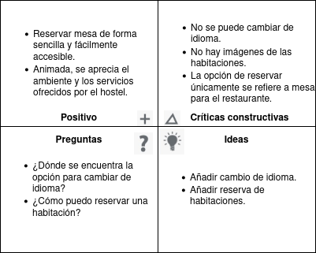

 2.b ScopeCanvas
----

Nuestra propuesta de valor consiste en implementar la posibilidad de poder reservar una habitación a través de la página web del hostel Consideramos que es algo vital y característico que encontrarías en casi cualquier otro hostel u hotel. A través de un diseño de las interfaces pertinentes que permitan al usuario reservar habitación de forma intuitiva, rápida y sencilla, se le estaría facilitando la acción al usuario, y además descargando al empleado del hostel de un trabajo que puede ser realizado de forma automática.

A parte de esta propuesta, le hemos añadido a la web la opción de cambiar de idioma, lo cual aportaría mucho valor y ampliaría el rango de clientes que podrían, por lo pronto, entender mejor el contenido de la web y plantearse más seriamente si acudir o no. 

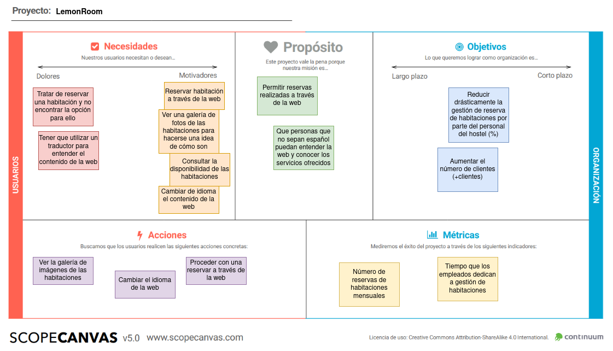

 2.b Tasks analysis 
-----

En este caso, hemos decidido hacer dos diferenciaciones distintas: en función de si son españoles o extrajeros, y en función de su edad. 

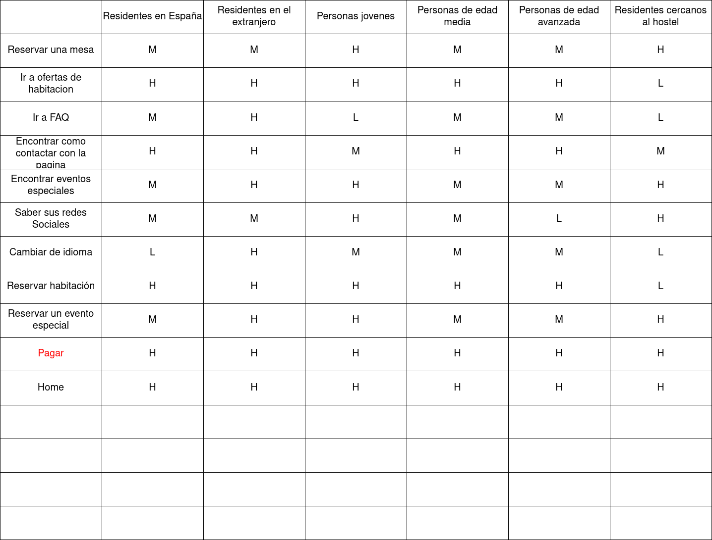

 2.c IA: Sitemap + Labelling 
----

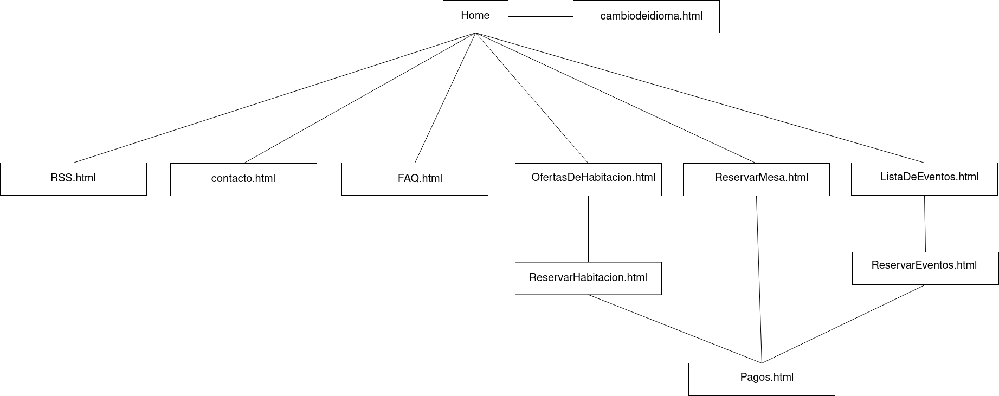

Término | Significado     
| ------------- | -------
  Home  | Página principal del hostel. Se presentan las distintas opciones que el usuario puede realizar.
  Cambiar idioma  | En este caso podría estar implementado como banderas representando cada idioma.
  Reservar habitacion  | Permite al usuario navegar a la página de reserva de habitación.
  Eventos  | Permite al usuario ver la lista de próximos eventos e incluso reservar para poder acudir si fuese necesario.
  FAQ  | Típica opción de preguntas frecuentes donde se responden las dudas más habituales que puedan surgirle al usuario.
  Contacto  | Ofrece las distintas formas de contacto que el hostel ponga a disposición del usuario.
  RSS  | Muestra las redes sociales del hostel.

 2.d Wireframes
-----

El prototipo de interfaces del sitio se ha realizado utilizando la herramiento drawio.

<!-- ------------------- -->

Home

<!-- ------------------- -->

Lista de habitaciones

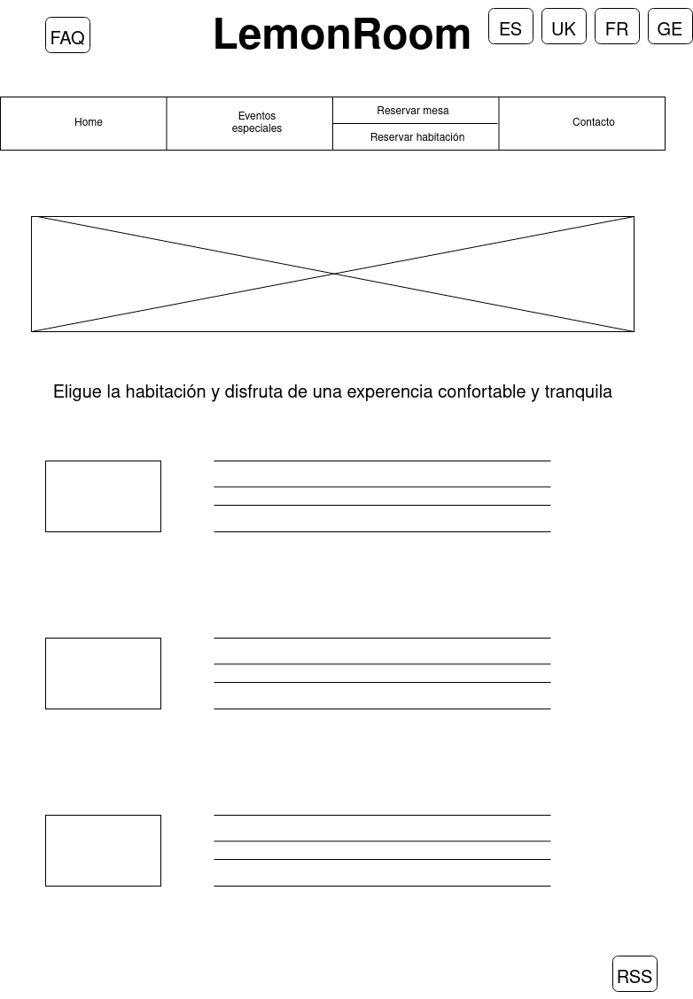

<!-- ------------------- -->

Reservar habitación

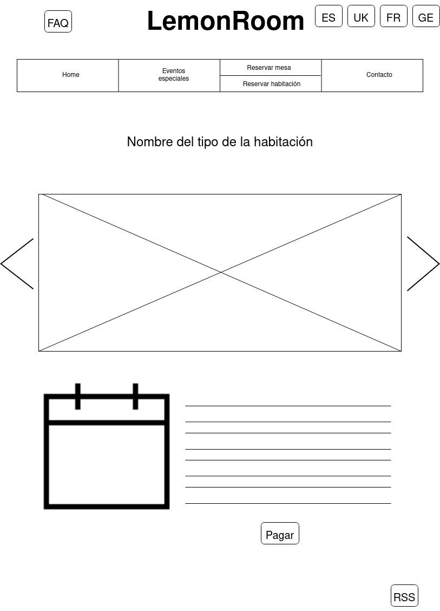

<!-- ------------------- -->

Reservar mesa

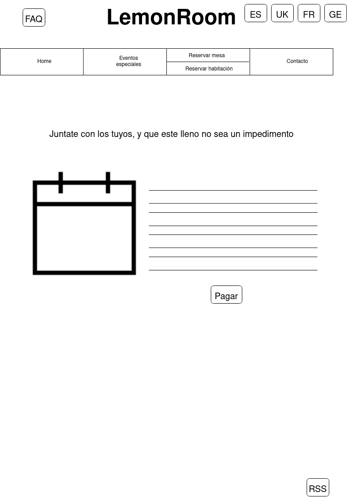

<!-- ------------------- -->

Lista de eventos

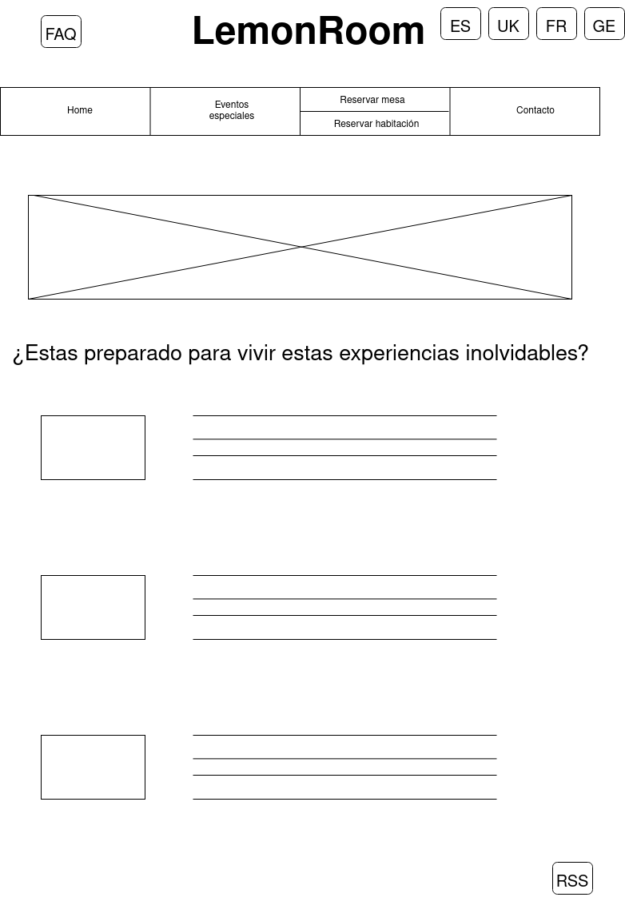

<!-- ------------------- -->

Reservar evento

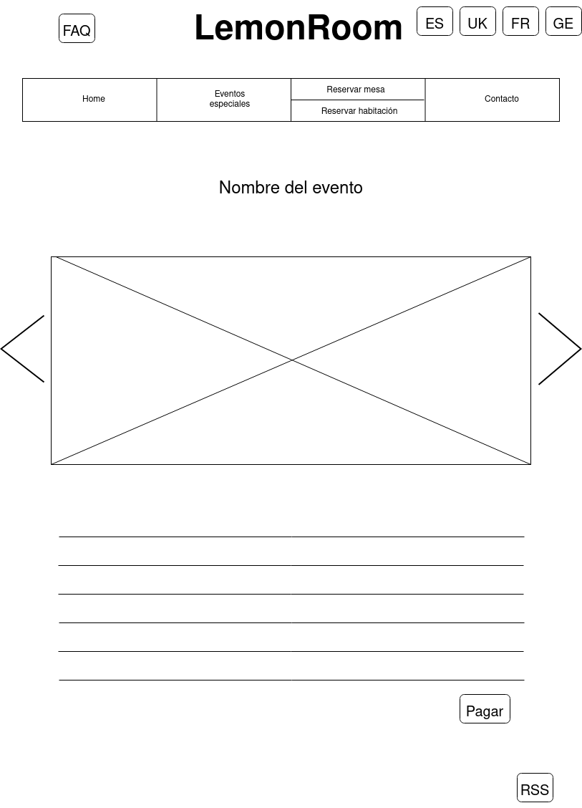

<!-- ------------------- -->

Pagar

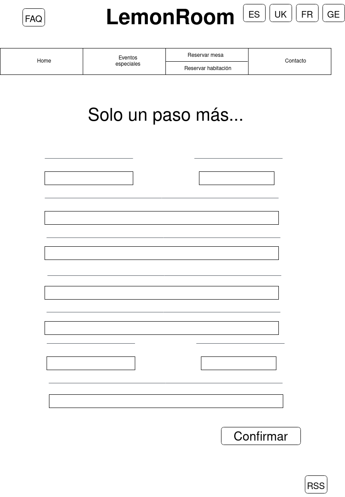

<!-- ------------------- -->

Contacto

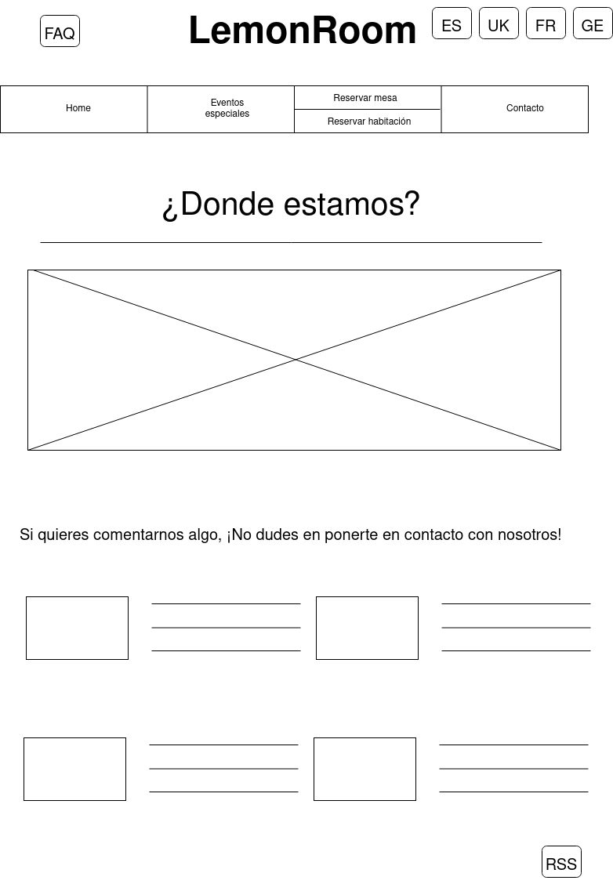

<!-- ------------------- -->

FAQ

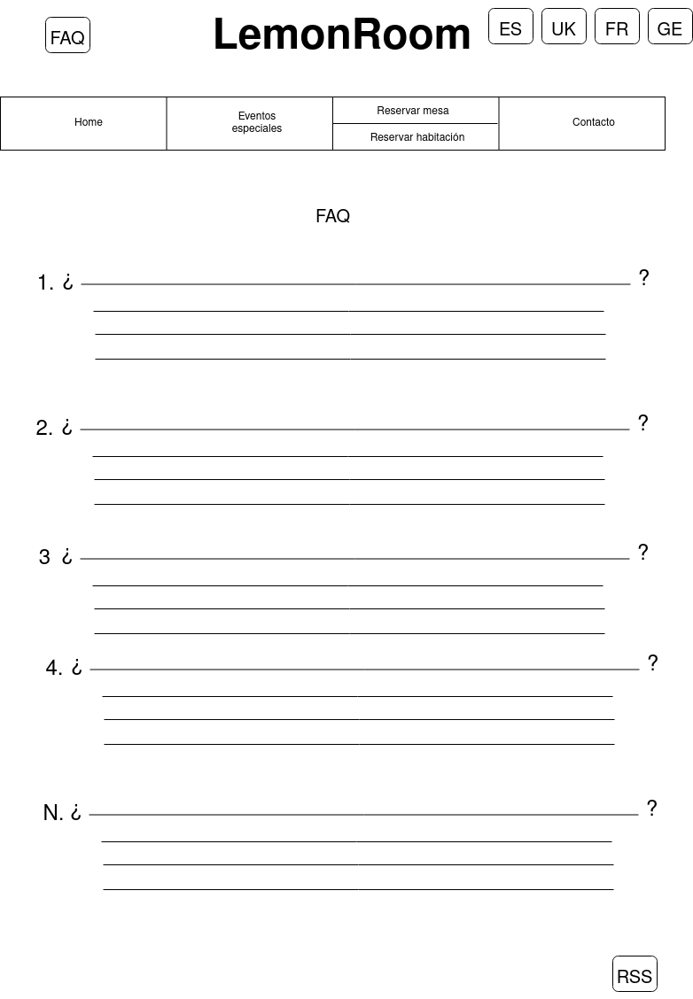

## Paso 3. Mi UX-Case Study (diseño)

 3.a Moodboard
-----

>>> Plantear Diseño visual con una guía de estilos visual (moodboard) 
>>> Incluir Logotipo
>>> Si diseña un logotipo, explique la herramienta utilizada y la resolución empleada. ¿Puede usar esta imagen como cabecera de Twitter, por ejemplo, o necesita otra?

  3.b Landing Page
----

>>> Plantear Landing Page 

 3.c Guidelines
----

>>> Estudio de Guidelines y Patrones IU a usar 
>>> Tras documentarse, muestre las deciones tomadas sobre Patrones IU a usar para la fase siguiente de prototipado. 

  3.d Mockup
----

>>> Layout: Mockup / prototipo HTML  (que permita simular tareas con estilo de IU seleccionado)

 3.e ¿My UX-Case Study?
-----

>>> Publicar my Case Study en Github..
>>> Documente y resuma el diseño de su producto en forma de video de 90 segundos aprox

## Paso 4. Evaluación 

 4.a Caso asignado
----

>>> Breve descripción del caso asignado con enlace a  su repositorio Github

 4.b User Testing
----

>>> Seleccione 4 personas ficticias. Exprese las ideas de posibles situaciones conflictivas de esa persona en las propuestas evaluadas. Asigne dos a Caso A y 2 al caso B
 

| Usuarios | Sexo/Edad     | Ocupación   |  Exp.TIC    | Personalidad | Plataforma | TestA/B
| ------------- | -------- | ----------- | ----------- | -----------  | ---------- | ----
| User1's name  | H / 18   | Estudiante  | Media       | Introvertido | Web.       | A 
| User2's name  | H / 18   | Estudiante  | Media       | Timido       | Web        | A 
| User3's name  | M / 35   | Abogado     | Baja        | Emocional    | móvil      | B 
| User4's name  | H / 18   | Estudiante  | Media       | Racional     | Web        | B 

. 4.c Cuestionario SUS
----

>>> Usaremos el **Cuestionario SUS** para valorar la satisfacción de cada usuario con el diseño (A/B) realizado. Para ello usamos la [hoja de cálculo](https://github.com/mgea/DIU19/blob/master/Cuestionario%20SUS%20DIU.xlsx) para calcular resultados sigiendo las pautas para usar la escala SUS e interpretar los resultados
http://usabilitygeek.com/how-to-use-the-system-usability-scale-sus-to-evaluate-the-usability-of-your-website/)
Para más información, consultar aquí sobre la [metodología SUS](https://cui.unige.ch/isi/icle-wiki/_media/ipm:test-suschapt.pdf)

>>> Adjuntar captura de imagen con los resultados + Valoración personal 

 4.d Usability Report
----

>> Añadir report de usabilidad para práctica B (la de los compañeros)

>>> Valoración personal 

>>> ## Paso 5. Evaluación de Accesibilidad  (no necesaria)

>>>   5.a Accesibility evaluation Report 
>>>> ----

>>> Indica qué pretendes evaluar (de accesibilidad) sobre qué APP y qué resultados has obtenido 

>>> 5.a) Evaluación de la Accesibilidad (con simuladores o verificación de WACG) 
>>> 5.b) Uso de simuladores de accesibilidad 

>>> (uso de tabla de datos, indicar herramientas usadas) 

>>> 5.c Breve resumen del estudio de accesibilidad (de práctica 1) y puntos fuertes y de mejora de los criterios de accesibilidad de tu diseño propuesto en Práctica 4.

## Conclusión final / Valoración de las prácticas

>>> (90-150 palabras) Opinión del proceso de desarrollo de diseño siguiendo metodología UX y valoración (positiva /negativa) de los resultados obtenidos  

