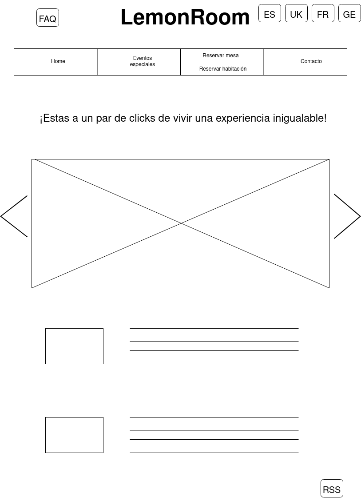
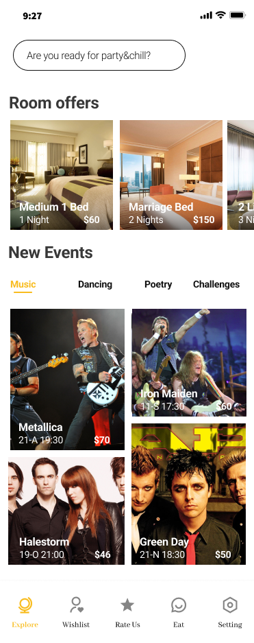

# DIU22
Prácticas Diseño Interfaces de Usuario 2021-22 (Tema: Hostels) 

Grupo: DIU1_ForTheWin.  Curso: 2021/22 
Updated: 11/2/2022

Proyecto: 

>>> LemonRoom

Descripción: 

>>> LemonRoom será una funcionalidad que permitirá al usuario reservar habitación en el hostel a través de la web.

Logotipo: 

Miembros
 * Ricardo Molina Rodriguez   
 * Carlos Corts Valdivia

----- 

# Proceso de Diseño 

## Paso 1. UX Desk Research & Analisis 

 1.a Competitive Analysis
-----

Las características que hemos decidido evaluar son:
 * Proporciona acceso, o al menos se muestran las redes sociales del hostel.
 * Te permite cambiar el idioma de la web.
 * Facilita más de una forma de contacto.
 * Muestra fotos de las habitaciones.
 * Muestra de forma gráfica (fotos o vídeos) los servicios ofrecidos.
 * Describe el lugar en el que se encuentra, el ambiente que se respira.
 * Ofrece información acerca de medidas tomadas con respecto al Covid.
 Según este análisis, el "White Nest Hostel" sería el mejor competidor, pues cumple con todas las características valoradas. Incluso "Oh! My Hostel" cumple con más características.

 Desde nuestro punto de vista, lo más grave respecto a la web del Lemon Rock es el hecho de no dar la opción de cambiar de idioma. Sin embargo, en el resto de aspectos diríamos que la web del Lemon es mejor, o al menos visualmente más atractiva, mostrando de diversas formas los servicios ofrecidos por el hostel.

 Por un lado, la web de "White Nest Hostel" se ve bastante desfasada, y además el rendimiento es lento con respecto a las otras dos webs valoradas. Por otro lado, se podría decir que la web de "Oh! My Hostel" y del Lemon están a un nivel parecido, aunque como se ha dicho antes, la del Lemon muestra de forma más clara y atractiva lo que vas a encontrar en el hostel.

 1.b Persona
-----

Hemos elegido esta persona debido a que es una persona joven, dado que los jóvenes suelen frecuentar más este tipo de alojamiento.

Sin embargo, también hemos querido ver un caso opuesto de una persona mayor para ver el contraste que podemos tener para elegir un hostel. Ambos lo hacen porque es una opción barata, pero para decidir entre uno u otro tienen criterios bastante diferentes.

 1.c User Journey Map
----

Son dos experiencias de usuario ligadas a nuestras dos personas. Se ha realizado de esta forma para ver las situaciones que se pueden encontrar en el proceso de búsqueda y elección, y para demostrar que hay determinados casos en los que una persona mayor tiene más facilidad para encontrar lo que busca ya que le han enseñado y lo hace habitualmente, mientras que para la persona joven es su primera vez. Al final sus criterios la mayoría de las veces son diametralmente opuestos y las sensaciones que produzca la pagina web pueden llegar a ser influyentes a la hora de la elección.

 1.d Usability Review
----

La valoración numérica obtenida a partir de la revisión de usabilidad es de 74 sobre 100. A priori y con los conocimientos que tenemos de momento, consideramos que es una puntuación bastante fiel. La nota es alta, reflejando que se trata de una web relativamente bien diseñada. Sin embargo, no es lo suficientemente elevada, de forma que se podría sacar como conclusión que hay otras tantas webs que quedarían por encima.

## Paso 2. UX Design  

 2.a Feedback Capture Grid / Empathy map / POV
----

Hemos decidido utilizar la malla receptora ya que nos parece la más sencilla y directa de implementar, y además, a partir de la cual podemos sacar más conclusiones.

 2.b ScopeCanvas
----

Nuestra propuesta de valor consiste en implementar la posibilidad de poder reservar una habitación a través de la página web del hostel Consideramos que es algo vital y característico que encontrarías en casi cualquier otro hostel u hotel. A través de un diseño de las interfaces pertinentes que permitan al usuario reservar habitación de forma intuitiva, rápida y sencilla, se le estaría facilitando la acción al usuario, y además descargando al empleado del hostel de un trabajo que puede ser realizado de forma automática.

A parte de esta propuesta, le hemos añadido a la web la opción de cambiar de idioma, lo cual aportaría mucho valor y ampliaría el rango de clientes que podrían, por lo pronto, entender mejor el contenido de la web y plantearse más seriamente si acudir o no. 

 2.b Tasks analysis 
-----

En este caso, hemos decidido hacer dos diferenciaciones distintas: en función de si son españoles o extrajeros, y en función de su edad. 

 2.c IA: Sitemap + Labelling 
----

Término | Significado     
| ------------- | -------
  Home  | Página principal del hostel. Se presentan las distintas opciones que el usuario puede realizar.
  Cambiar idioma  | En este caso podría estar implementado como banderas representando cada idioma.
  Reservar habitacion  | Permite al usuario navegar a la página de reserva de habitación.
  Eventos  | Permite al usuario ver la lista de próximos eventos e incluso reservar para poder acudir si fuese necesario.
  FAQ  | Típica opción de preguntas frecuentes donde se responden las dudas más habituales que puedan surgirle al usuario.
  Contacto  | Ofrece las distintas formas de contacto que el hostel ponga a disposición del usuario.
  RSS  | Muestra las redes sociales del hostel.

 2.d Wireframes
-----

El prototipo de interfaces del sitio se ha realizado utilizando la herramiento drawio.

<!-- ------------------- -->

Home

<!-- ------------------- -->

Lista de habitaciones

<!-- ------------------- -->

Reservar habitación

<!-- ------------------- -->

Reservar mesa

<!-- ------------------- -->

Lista de eventos

<!-- ------------------- -->

Reservar evento

<!-- ------------------- -->

Pagar

<!-- ------------------- -->

Contacto

<!-- ------------------- -->

FAQ

## Paso 3. Mi UX-Case Study (diseño)

 3.a Moodboard
-----

  3.b Landing Page
----

Hemos utilizado la herramienta [Web Flow](https://webflow.com). Se puede previsualizar en el siguiente enlace: [link](https://lemonroom-landing-page.webflow.io/). Puesto que estamos ofertando tanto eventos como habitaciones, se dan dos CTAs cercanos entre ellos para no desviar la atención y centrar el foco en ambos.

 3.c Guidelines
----

Para documentarnos en esta sección hemos usado como fuente [ui-patterns](https://ui-patterns.com/patterns). Hemos considerado que los patrones más significativos para aplicar en el diseño son los siguientes:
 * Patrón [Navigation Tabs](https://ui-patterns.com/patterns/NavigationTabs) para la navegación por las diferentes secciones de la app. Es un patrón bastante habitual y estándar tanto en web como en apps, con muchas posibilidades de personalización, pero siempre bajo la misma dinámica. En nuestro caso, se trata de una barra horizontal situada en la parte baja para facilitar la navegación por las distintas secciones.
 * Patrón [Structured Format](https://ui-patterns.com/patterns/StructuredFormat) para formularios, a la hora de organizar los campos de entrada en los que el usuario introducirá las diferentes opciones sobre su reserva. De esta forma, se estará controlando y facilitando las posibles entradas, por ejemplo fechas (en un calendario), número de personas (con un campo numérico), etc.
 * Patrón [Event Calendar](https://ui-patterns.com/patterns/EventCalendar) para mostrar contenido, en nuestro caso la lista de próximos eventos que tendrán lugar. Importante mostrar la información que un usuario considerará relevante para saber si le interesa o no el evento, como podría ser fecha, artistas implicados, tipo de evento, alguna imagen significativa. Además sería interesante ordenar los eventos, por ejemplo por proximidad de fecha, y ofrecer la opción de filtrar (por tipo de evento, por artista, etc).
 * Patrón [Gallery](https://ui-patterns.com/patterns/Gallery) para mostrar imágenes, en nuestro caso relativas a las habitaciones. El usuario debe navegar fácilmente a través de la galería, y además que esta navegación tenga un sentido, es decir, que el orden en que aparecen las imágenes esté estructurado y tengas la sensación más cercana posible a estar visitando el lugar.

  3.d Mockup
----

Splash             | Chat             | Profile
:-------------------------:|:-------------------------:|:-------------------------:
  |   |  

Explore             | Explore Evento             | Explore Habitacion
:-------------------------:|:-------------------------:|:-------------------------:
  |   | 

 3.e ¿My UX-Case Study?
-----

## Paso 4. Evaluación 

 4.a Caso asignado
----

https://github.com/jmegui/DIU

Los compañeros proponen una oferta gastrónomica durante la semana del Corpus, en la que cada día habrá un menú especial y se homenajeará a una figura del rock. El objetivo que tienen es hacer más llamativo y simplificar el diseño actual, haciéndolo más intuitivo.

 4.b User Testing
----

 * **Federico Alarcos** (4,3,4) = Discapacitado, Fiestero y Sorprendido.
 Es un señor que no puede mover bien su brazo izquierdo, pero más o menos se apaña para poder navegar por Internet, aunque necesita un teclado especializado. Tiene 35 años, puede llevar una vida más o menos normal pese a su discapacidad. No trabaja, recibe una subvención del estado y está todo el dia de fiesta. Su actitud hacia la tecnología es baja, aunque está sorprendido por todo lo que puede hacer la página web. Windows
 
 * **Ana Guillamón** (2,1,6) = Madre, Estudiante y Triste.
 Es una madre que tuvo un hijo con 20 años. Está estudiando la carrera de filología inglesa, pero ya no tiene tiempo para nada y está triste por eso. Su actitud hacia la tecnología es alta. Linux
 
 * **Raul Capilla** (4,4,6) = Discapacitado, Mozo de Almacén y Triste.
 Tiene una discapacidad por ser sordomudo. Trabaja de mozo en un almacén, donde le hacen gestos para saber lo que tiene que recoger. Tiene 50 años, pero está triste porque le gustaria dominar más la aplicación, y su actitud hacia la tecnología es media. Mac

* **Alexia Putellas** (5,2,5) = 40 años, Traductor y Disgustado.
 Es una mujer que ya hace tiempo que se graduó y se gana la vida como traductora. Se encuentra en un estado continuo de disgusto porque las traducciones del traductor de google de la versión en alemán no son fidedignas para nada. Phone

. 4.c Cuestionario SUS
----

>>> Adjuntar captura de imagen con los resultados + Valoración personal 

 4.d Usability Report
----

>> Añadir report de usabilidad para práctica B (la de los compañeros)

 * **Moodboard.**
 La elección de colores la considero muy adecuada, ya que su propuesta se basa en mantenerse cercanos al diseño original. Desde mi punto de vista, son colores que casan muy bien y refuerzan la identidad del hostel. El logo me parece un acierto, de hecho si fuese el dueño del Lemonrock me plantearía seriamente adoptarlo.
 
 
 * **Landing page.**
 
 
 
 * **Prototipo.**
 

